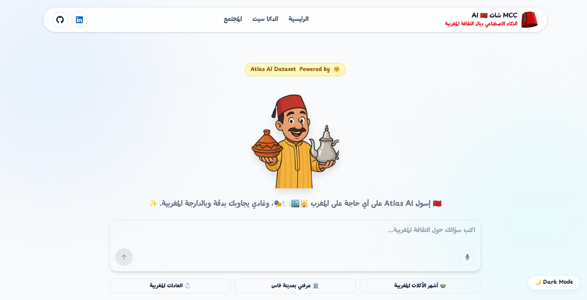

<div align="center">
    <h1>🇲🇦 Morrocan Chat Culture 🇲🇦</h1>
    
</div>

A project for collecting and serving Moroccan chat/culture data with a **FastAPI** backend and a **Vite + React** frontend. The project integrates with **Qdrant** for vector search and includes tooling to run locally.

---

## Features

- **FastAPI** backend for serving the chat collection and embeddings  
- Deployed backend in **Azure**  
- **Vite + React** frontend for browsing and searching the dataset  
- **Qdrant** vector database integration for semantic search  
- Simple local dev setup with a **Python virtualenv** and **npm/yarn** for frontend  

---

## Quick Start

Prerequisites:

- **Python 3.11+** (virtualenv recommended)
- **Node.js 18+** and npm or yarn
- (Optional) **Qdrant Cloud** account or local Qdrant instance

1) Create and activate Python virtual environment (example):

```bash
python3 -m venv backend_test/venv
source backend_test/venv/bin/activate
pip install -r backend_test/requirements.txt
```

2) Run the backend (from repo root):

```bash
cd backend_test
# ensure virtualenv activated
uvicorn main:app --reload
```

3) Install and run the frontend (from `frontend/app`):

```bash
cd frontend/app
npm install
npm run dev
```

Open the frontend local URL printed by Vite (typically http://localhost:5173) and the backend at http://127.0.0.1:8000.

---

## Environment & Configuration

- Backend configuration and secrets (Qdrant API key, host, etc.) should be provided via environment variables or a `.env` file in `backend_test/`.
- Example environment variables:

```
OPENAI_API_KEY = "..."
GROQ_API_KEY = "..."
GEMINI_API_KEY = "..."
HF_TOKEN =  "..."
QDRANT_CLOUD_API_KEY = "..."
QDRANT_CLOUD_ENDPOINT = "..."
```

---

## Qdrant Access

This project uses Qdrant to store and query vector embeddings. If you are using Qdrant Cloud, paste your dashboard URL in your notes and set the `QDRANT_URL` and `QDRANT_API_KEY` accordingly.

Refer to Qdrant docs: https://qdrant.tech/documentation/manage-data/collections/

---

## Screenshots


---

## Project Structure

- `backend_test/` — Python backend and virtual environment.
- `frontend/app` — Vite + React frontend

---

## Contributing

1. Fork the repo
2. Create a feature branch
3. Open a pull request with a clear description

---

⭐ Special Thanks to [AtlasAI Community](https://huggingface.co/atlasia) for providing the dataset used in this project.


